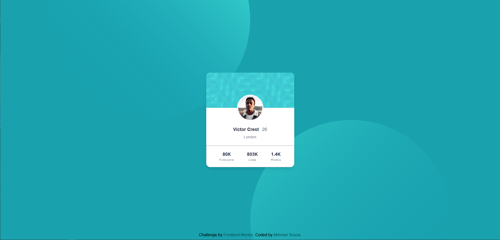

# Frontend Mentor - Profile card component solution

This is a solution to the [Profile card component challenge on Frontend Mentor](https://www.frontendmentor.io/challenges/profile-card-component-cfArpWshJ). Frontend Mentor challenges help you improve your coding skills by building realistic projects.

## Table of contents

-   [Overview](#overview)
    -   [The challenge](#the-challenge)
    -   [Screenshot](#screenshot)
    -   [Links](#links)
-   [My process](#my-process)
    -   [Built with](#built-with)
    -   [What I learned](#what-i-learned)
    -   [Continued development](#continued-development)
    -   [Useful resources](#useful-resources)
-   [Author](#author)
-   [Acknowledgments](#acknowledgments)

## Overview

### The challenge

-   Build out the project to the designs provided

### Screenshot

    
  
     

   

### Links

-   Solution URL: [GitHub source code](https://github.com/M-its/profile-card-component)
-   Live Site URL: [Product preview card component page](https://m-its.github.io/profile-card-component/)

## My process

### Built with

-   Semantic HTML5 markup
-   CSS custom properties
-   Flexbox
-   [Tailwind](https://tailwindcss.com/) - Tailwind
-   Mobile-first workflow

### What I learned

In this project i learned how to use 2 images at the same time by using css "background-image" propriety, and also learned how to position an image above its container by using css "translate" propriety.

### Continued development

I need to get more used to tailwind css.

### Useful resources

-   [Tailwind - Documentation](https://tailwindcss.com/docs/installation) - This documentation was my guide during all the project.
-   [kelvinappiah - Profile card solution](https://github.com/kelvinappiah/Profile-card/blob/main/styles.css) - It was from this CSS code that I took the solution for the background.

## Author

-   GitHub - [@M-its](https://github.com/M-its)
-   Frontend Mentor - [@M-its](https://www.frontendmentor.io/profile/M-its)
-   Codepen - [@M-its](https://codepen.io/m-its)

## Acknowledgments

It was my first time dealing with 2 images in the background. At first I didn't know it was possible so I tried approaches with absolute divs or putting the images as background in the header and footer, but none of this gave good results. After spending quite a bit of time failing to solve it I started looking for topics on Stakoverflow. I managed to get pretty close to the result, but it was still a little different. Looking for another way to get to the perfect result I came up with the user [kelvinappiah](https://www.frontendmentor.io/profile/kelvinappiah) solution. With a few small changes it worked perfectly in my code.
